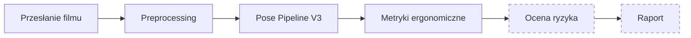

# Ergonomia AI

System do analizy ergonomii pracy na podstawie krótkiego nagrania wideo.

Ergonomia AI wykrywa sylwetkę pracownika, śledzi ruch, oblicza metryki postawy i przygotowuje dane do dalszej oceny ryzyka ergonomicznego.

> **Ważne:** system wspiera analizę i nie zastępuje oceny wykonanej przez specjalistę BHP lub ergonomii.

---

## O projekcie

Celem projektu jest uproszczenie wstępnej analizy ergonomii stanowisk pracy.

Użytkownik przesyła film, a system:

1. przygotowuje nagranie do analizy,
2. wykrywa pracownika,
3. śledzi pozycję ciała i dłoni,
4. oblicza metryki ergonomiczne,
5. przygotowuje dane do oceny ryzyka,
6. zapisuje materiały wynikowe w prywatnym Storage.

Projekt łączy aplikację internetową, bazę danych Supabase oraz lokalne workery Python wykorzystujące GPU.

---

## Aktualny stan projektu

### Gotowe

- aplikacja internetowa w Next.js,
- rejestracja i logowanie użytkowników,
- prywatne przechowywanie filmów,
- przesyłanie i usuwanie analiz,
- kolejka analiz,
- preprocessing nagrania,
- wykrywanie pracownika,
- śledzenie sylwetki,
- analiza dłoni,
- generowanie filmu ze szkieletem,
- zapis punktów pozy,
- Ergonomics Metrics Engine V1,
- Ergonomics Worker,
- zapis metryk w Supabase i Storage,
- niezależny Risk Engine V1,
- panel użytkownika,
- panel administratora,
- strona projektu i autora.

### W realizacji

- integracja Risk Engine z kolejką,
- Risk Worker,
- automatyczny zapis `risk-assessment.json`,
- prezentacja ryzyka w panelu użytkownika,
- wykresy metryk,
- kluczowe klatki analizy.

### Planowane

- produkcyjny profil progów ergonomicznych,
- panel konfiguracji progów,
- raport końcowy,
- eksport PDF,
- metody RULA i REBA,
- hosting workerów,
- automatyczne czyszczenie starych filmów,
- testy walidacyjne na większej liczbie nagrań.

Aktualny procent realizacji projektu jest obliczany automatycznie na podstawie centralnej konfiguracji etapów.

---

## Jak działa analiza



### 1. Preprocessing

Worker sprawdza nagranie, przygotowuje pliki robocze i aktualizuje status analizy.

### 2. Pose Pipeline V3.0

Pipeline:

- wykrywa osoby przy użyciu YOLOX-X,
- wybiera głównego pracownika,
- analizuje pozycję ciała przy użyciu RTMW,
- analizuje dłonie,
- wygładza ruch punktów,
- wykrywa aktywny fragment filmu,
- generuje film ze szkieletem,
- zapisuje dane punktów pozy do JSON.

### 3. Ergonomics Metrics Engine V1

Silnik oblicza między innymi:

- pochylenie tułowia,
- zgięcie szyi,
- uniesienie ramion,
- zgięcie łokci,
- położenie przedramion,
- zgięcie nadgarstków,
- stopień zamknięcia dłoni,
- odległość chwytu szczypcowego.

Każda metryka zawiera również informację o jakości, poprawności i przyczynie ewentualnego odrzucenia.

### 4. Risk Engine V1

Risk Engine działa obecnie jako niezależny moduł.

Obsługuje:

- profile progów w wersjonowanym pliku JSON,
- ocenę pojedynczych klatek,
- analizę ekspozycji w czasie,
- agregację wyników,
- wykrywanie kluczowych klatek,
- wynik `insufficient_data`,
- zabezpieczenie przed pominięciem krótkiego, ale wysokiego ryzyka.

Moduł nie jest jeszcze podłączony do głównej kolejki analiz.

---

## Technologie

### Frontend

- Next.js 16
- React 19
- TypeScript
- Tailwind CSS
- React Three Fiber
- Three.js
- Drei

### Backend i dane

- Supabase Auth
- PostgreSQL
- Supabase Storage
- Row Level Security
- funkcje RPC PostgreSQL

### Analiza obrazu

- Python 3.11
- PyTorch
- CUDA
- YOLOX-X
- RTMW WholeBody
- MediaPipe Hand Landmarker
- FFmpeg
- OpenCV

### Infrastruktura

- Vercel — aplikacja internetowa
- Supabase — baza, autoryzacja i Storage
- lokalny worker Python — analiza GPU i CPU

---

## Struktura projektu

```text
ergonomia-ai/
├── public/
│   └── modele i zasoby statyczne
│
├── src/
│   ├── app/
│   │   ├── admin/
│   │   ├── o-autorze/
│   │   ├── o-projekcie/
│   │   └── panel/
│   │
│   ├── components/
│   │   ├── analyses/
│   │   ├── landing/
│   │   ├── layout/
│   │   ├── project/
│   │   └── three/
│   │
│   ├── config/
│   └── lib/
│       └── supabase/
│
├── supabase/
│   └── migrations/
│
├── worker/
│   ├── src/
│   │   ├── ergonomics/
│   │   ├── pose_v3/
│   │   ├── risk/
│   │   ├── main.py
│   │   ├── pose_worker.py
│   │   └── ergonomics_worker.py
│   │
│   ├── tests/
│   ├── models/
│   ├── data/
│   ├── logs/
│   └── outputs/
│
└── README.md
```

> Wszystkie migracje Supabase muszą znajdować się w katalogu `supabase/migrations/`.

---

# Uruchomienie lokalne

## Wymagania

- Node.js
- npm
- Python 3.11
- FFmpeg
- konto i projekt Supabase
- opcjonalnie karta NVIDIA z CUDA do szybszej analizy pozy

---

## 1. Pobranie projektu

```powershell
git clone /tolpamaksymilian/ergonomia-ai
cd ergonomia-ai
```

---

## 2. Instalacja frontendu

```powershell
npm install
```

---

## 3. Konfiguracja aplikacji Next.js

Utwórz w głównym katalogu plik:

```text
.env.local
```

Zawartość:

```env
NEXT_PUBLIC_SUPABASE_URL=https://YOUR_PROJECT_ID.supabase.co
NEXT_PUBLIC_SUPABASE_PUBLISHABLE_KEY=YOUR_PUBLISHABLE_KEY
```

Nie używaj w aplikacji frontendowej klucza `secret` ani `service_role`.

---

## 4. Konfiguracja workera

Utwórz:

```text
worker/.env
```

Podstawowa konfiguracja:

```env
SUPABASE_URL=https://YOUR_PROJECT_ID.supabase.co
SUPABASE_SECRET_KEY=YOUR_SERVER_SIDE_SECRET_KEY

ANALYSIS_BUCKET=analysis-videos
ANALYSIS_RESULTS_BUCKET=analysis-results

WORKER_ID=local-worker-01
ERGONOMICS_WORKER_ID=local-ergonomics-worker-01

WORKER_POLL_INTERVAL_SECONDS=10
WORKER_LOG_LEVEL=INFO
KEEP_WORKER_FILES=false

FFMPEG_PATH=
```

Plik zawiera również konfigurację modeli Pose Pipeline.

Pełny przykład znajduje się w:

```text
worker/.env.example
```

> `SUPABASE_SECRET_KEY` jest sekretem serwerowym. Nie wolno umieszczać go w `.env.local`, kodzie przeglądarki ani repozytorium Git.

---

## 5. Migracje Supabase

Migracje znajdują się wyłącznie w:

```text
supabase/migrations/
```

Należy wykonać je chronologicznie w projekcie Supabase.

Można je uruchomić:

- przez Supabase SQL Editor,
- albo przez Supabase CLI po skonfigurowaniu projektu.

Po wykonaniu migracji można odświeżyć schemat API:

```sql
notify pgrst, 'reload schema';
```

---

## 6. Uruchomienie aplikacji

```powershell
npm.cmd run dev
```

Aplikacja będzie dostępna pod adresem:

```text
http://localhost:3000
```

---

# Uruchomienie nowej analizy

## 1. Prześlij film

Zaloguj się i przejdź do:

```text
http://localhost:3000/panel/analizy/nowa
```

Po przesłaniu filmu powstanie nowy rekord analizy.

---

## 2. Preprocessing

```powershell
.\worker\.venv\Scripts\python.exe .\worker\src\main.py --once
```

---

## 3. Pose Pipeline V3.0

```powershell
.\worker\.venv\Scripts\python.exe .\worker\src\pose_worker.py --once
```

Po zakończeniu powinny powstać między innymi:

```text
pose-overlay.mp4
pose-thumbnail.jpg
pose-keypoints.json
```

Analiza powinna przejść do etapu:

```text
ready-for-ergonomics
```

---

## 4. Metryki ergonomiczne

```powershell
.\worker\.venv\Scripts\python.exe .\worker\src\ergonomics_worker.py --once
```

Po zakończeniu powstaje:

```text
ergonomics-metrics.json
```

Analiza przechodzi do etapu:

```text
ready-for-risk-assessment
```

---

## Aktualny koniec automatycznego pipeline’u

Obecnie automatyczny proces kończy się na:

```text
progress = 90
processing_stage = ready-for-risk-assessment
```

Risk Engine działa, ale nie jest jeszcze automatycznie uruchamiany przez kolejkę.

---

# Uruchamianie workerów w pętli

Zamiast trybu jednorazowego można uruchomić workery bez parametru `--once`.

### Preprocessing

```powershell
.\worker\.venv\Scripts\python.exe .\worker\src\main.py
```

### Pose Pipeline

```powershell
.\worker\.venv\Scripts\python.exe .\worker\src\pose_worker.py
```

### Ergonomics Worker

```powershell
.\worker\.venv\Scripts\python.exe .\worker\src\ergonomics_worker.py
```

Każdy worker powinien działać w osobnym terminalu.

---

# Testy

## Frontend

```powershell
npm.cmd run lint
npx.cmd tsc --noEmit
npm.cmd run build
```

## Python

Przykładowe uruchomienie testów:

```powershell
.\worker\.venv\Scripts\python.exe -m pytest .\worker\tests
```

Testy obejmują między innymi:

- geometrię metryk,
- walidację klatek,
- agregację wyników,
- ekspozycję w czasie,
- profile progów,
- klasyfikację ryzyka,
- obsługę niewystarczających danych.

---

# Pliki wynikowe

System może generować:

```text
pose-overlay.mp4
pose-thumbnail.jpg
pose-keypoints.json
ergonomics-metrics.json
risk-assessment.json
```

Pliki użytkowników są przechowywane w prywatnych bucketach Supabase Storage.

Dostęp odbywa się za pomocą krótkotrwałych podpisanych adresów URL.

---

# Bezpieczeństwo

Projekt wykorzystuje:

- Supabase Auth,
- prywatne buckety Storage,
- Row Level Security,
- kontrolę właściciela analizy,
- serwerowe funkcje RPC,
- osobne klucze dla aplikacji i workerów.

Nigdy nie należy dodawać do Git:

```text
.env
.env.local
worker/.env
worker/.venv/
worker/data/
worker/logs/
worker/models/
worker/outputs/
```

Klucz `SUPABASE_SECRET_KEY` może być używany wyłącznie przez zaufany proces serwerowy.

---

# Ograniczenia

Obecna wersja projektu:

- nie zastępuje specjalisty,
- nie stanowi certyfikowanego narzędzia diagnostycznego,
- nie generuje jeszcze końcowego raportu PDF,
- nie wykonuje jeszcze automatycznej oceny RULA i REBA,
- wymaga walidacji na większej liczbie nagrań,
- może mieć ograniczoną skuteczność przy zasłoniętej sylwetce, słabym świetle lub wielu osobach w kadrze.

Wyniki należy interpretować jako dane wspierające dalszą ocenę.

---

# Autor

**Maksymilian Tołpa**

Autor projektu Ergonomia AI.

Student informatyki, który łączy rozwój aplikacji, automatyzację i doświadczenie ze środowiska produkcyjnego.

Obszary zainteresowań:

- sztuczna inteligencja,
- automatyzacja procesów,
- ergonomia i bezpieczeństwo pracy,
- aplikacje internetowe,
- analiza danych.

Więcej informacji znajduje się na stronie:

```text
/o-autorze
```

---

# Roadmapa

Najbliższe etapy rozwoju:

- podłączenie Risk Engine do kolejki,
- utworzenie Risk Workera,
- prezentacja wyników ryzyka,
- wykresy metryk,
- wybór kluczowych klatek,
- raport końcowy,
- eksport PDF,
- profile progów,
- RULA i REBA,
- wdrożenie workerów na infrastrukturze produkcyjnej.

---

## Status projektu

Projekt jest aktywnie rozwijany.

Aktualna wersja koncentruje się na kompletnym przepływie:

```text
film → pozycja → metryki → ryzyko → raport
```

Pierwsze trzy etapy są już zintegrowane z kolejką aplikacji. Ocena ryzyka działa jako niezależny moduł i jest przygotowywana do integracji.